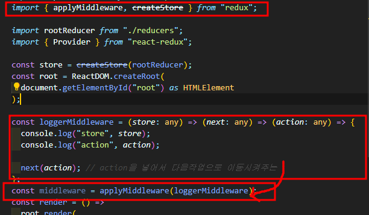
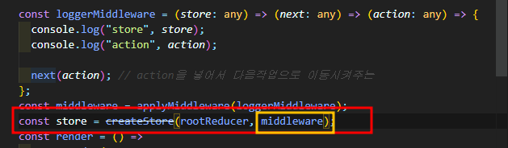
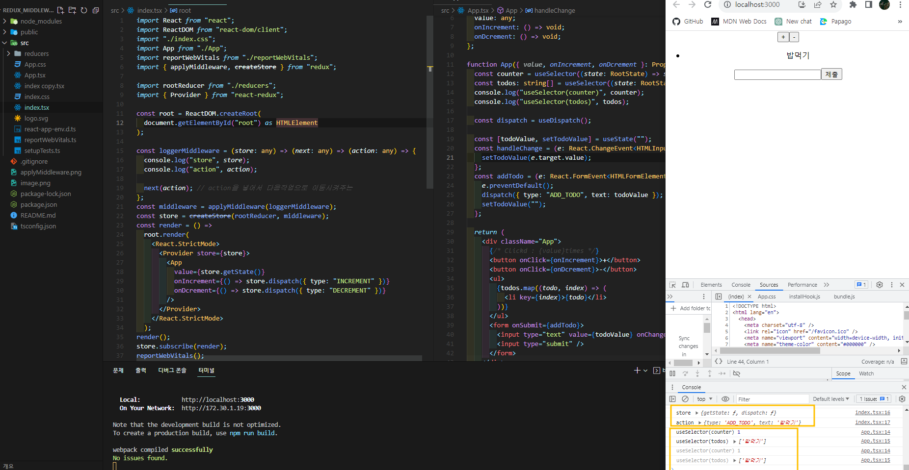
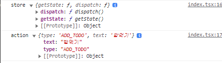
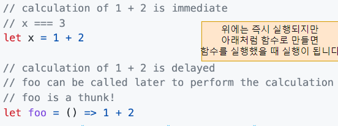
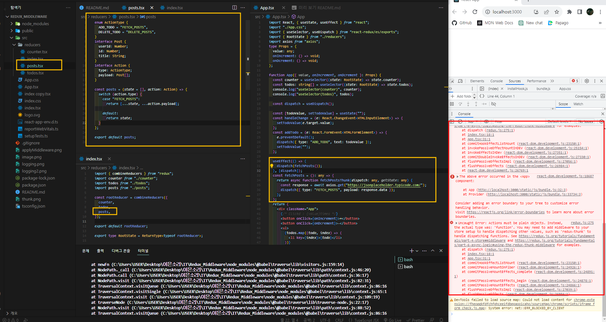
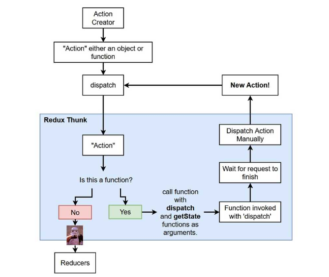

# Redux 미들웨어 알아보기

[Middleware 내용정리](https://eunsoly.tistory.com/70)
[참고사이트](https://www.freecodecamp.org/news/what-is-redux-middleware-and-how-to-create-one-from-scratch/)

### 미들웨어 생성하기

```
import { applyMiddleware} from "redux";
applyMiddleware()
```

### 1. redux-logger 미들웨어

> 상태 변화를 콘솔에 로그로 출력해주는 도구이며액션이 디스패치될 때마다 해당 액션과 이에 따른 상태 변화가 터미널에 로그로 출력됩니다. 이는 개발 과정에서 Redux의 동작을 쉽게 확인하고 디버깅하는 데 도움을 준다.

```
npm install redux-logger
```



2. 사용등록하기
   Store에 함께 매개변수로 전달하기
   

3. state 및 action의 동작 console창에서 확인가능
   
   

### 2. thunk 미들웨이

> 리덕스를 사용하는 앱에서 비동기 작업을 할 때 많이 사용하는 방법으로 thunk라는 단어는 '일부 지연된 작업을 수행하는 코드 조각' 이라는 뜻을 가지고 있으며 프로그래밍언어다. 지금 당장 일부 논리(logic)을 실행하는 대신 나중에 작업을 수행하는데 사용할 수 있는 함수 본문이나 코드조각을 의미
> 

1. Redux에 비동기 통신사용하기
   

   > 지금 console창과 같이 error가 나는이유는 Action은 객체이지만 현재 함수를 Dispatch 하고 있기 때문에 발생하는 Error로 이때 thunk 미들웨어 사용하여 함수를 Dispatch 할 수 있도록 해준다.

2. 설치하기

```
npm i redux-thunk --save
```


> 위의 이미지처럼 applyMiddleware에 thunk를 작성해주면 작동한다.


[출처](https://ncoughlin.com/posts/react-redux-asnychronous-actions-thunk/)
